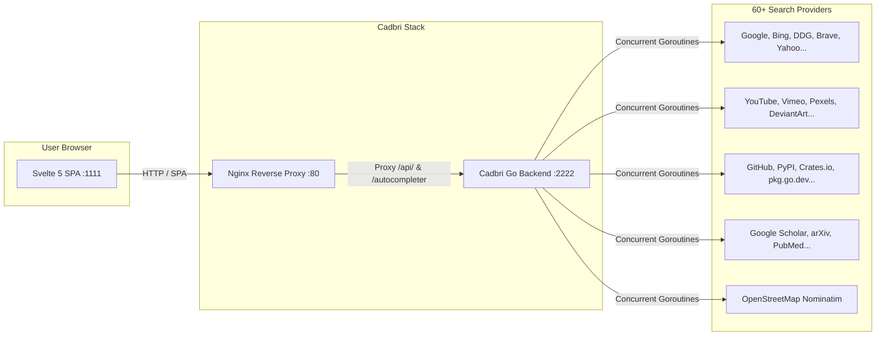

<div align="center">

# ⚡ Cadbri Search

**The Ultra-Fast, Privacy-First Metasearch Engine**

[](https://golang.org)
[](https://svelte.dev)
[](https://tailwindcss.com)
[](https://www.docker.com/)
[](https://github.com/Cadbri-X/Cadbri)
[](LICENSE)

*Cadbri is a modern, high-performance metasearch engine that aggregates results from 60+ upstream search engines simultaneously. Built with a concurrent Go backend and a reactive Svelte 5 + TailwindCSS v4 frontend, Cadbri delivers 50+ rich, deduplicated search results per query with absolute zero tracking.*

[Features](#-key-features) • [Quick Start](#-quick-start-docker) • [Architecture](#-architecture) • [API Reference](#-api-reference) • [Configuration](#-configuration)

---

</div>

## ✨ Key Features

- 🔒 **100% Privacy by Design**: Zero search logging, zero user profiling, automatic tracking parameter stripping (`utm_*`, `fbclid`, `gclid`), and referrer-shielded requests.
- 🚀 **50+ Results Per Query**: Queries dozens of search engines in parallel using Go goroutines, deduplicating and ranking results in milliseconds.
- 🌐 **60+ Upstream Engines**: Aggregates across 7 specialized categories (*General Web, Images, Videos, News, Maps, IT / Dev, and Science / Academic*).
- ⚡ **Svelte 5 & TailwindCSS v4**: Ultra-minimalist, buttery-smooth user interface with modern dark/light mode toggle, instant autocomplete, rich knowledge infoboxes, image modal viewers, and embedded video players.
- 🎯 **!Bang Shortcuts**: Instant routing to specific search engines and sites (e.g. `!g`, `!gh`, `!yt`, `!w`, `!ddg`, `!arxiv`, `!osm`).
- 🐳 **Zero-Config Docker Deployment**: Single-command production build with multi-stage Docker and optimized Nginx reverse proxy.

---

## 🏗️ Architecture



---

## 🚀 Quick Start (Docker)

The fastest and easiest way to run Cadbri is with **Docker Compose**:

```bash
# 1. Clone the repository
git clone https://github.com/Cadbri-X/Cadbri.git
cd Cadbri

# 2. Build and start containers
docker compose up --build -d
```

### Access Endpoints:
- 🌐 **Web Search UI**: [http://localhost:1111](http://localhost:1111)
- 🔍 **JSON Search API**: [http://localhost:2222/search?q=test&format=json](http://localhost:2222/search?q=test&format=json)
- 💡 **Autocomplete API**: [http://localhost:2222/autocompleter?q=test](http://localhost:2222/autocompleter?q=test)
- 💓 **Healthcheck Endpoint**: [http://localhost:2222/healthz](http://localhost:2222/healthz)

To stop the instance:
```bash
docker compose down
```

---

## 💻 Local Development

If you wish to contribute or develop locally without Docker:

### 1. Prerequisites
- **Go 1.24+** installed
- **Node.js 20+** installed

### 2. Backend (Go)
```bash
cd backend
go run ./cmd/server
```
The Go backend will start listening on `http://localhost:2222`.

### 3. Frontend (Svelte 5 + Vite)
```bash
cd frontend
npm install
npm run dev
```
The Vite development server will start on `http://localhost:1111` and automatically proxy API calls to the backend on `:2222`.

---

## 📖 API Reference

### `GET /search`
Perform a metasearch query across upstream engines.

#### Query Parameters:
| Parameter | Type | Default | Description |
| :--- | :--- | :--- | :--- |
| `q` | `string` | *Required* | Search query string (supports `!bang` prefixes) |
| `categories` | `string` | `general` | Categories to search (`general`, `images`, `videos`, `news`, `map`, `it`, `science`) |
| `pageno` | `integer` | `1` | Page number for paginated results |
| `format` | `string` | `json` | Response format (`json`, `csv`, `rss`, `html`) |
| `language` | `string` | `all` | Filter results by language code (e.g. `en`, `es`, `de`) |
| `safesearch` | `integer` | `0` | SafeSearch filter level (`0` = Off, `1` = Moderate, `2` = Strict) |
| `time_range` | `string` | `""` | Filter by time (`day`, `week`, `month`, `year`) |

#### Example Request:
```bash
curl -s "http://localhost:1111/api/search?q=golang&format=json"
```

---

### `GET /autocompleter`
Get live search suggestions.

#### Query Parameters:
| Parameter | Type | Default | Description |
| :--- | :--- | :--- | :--- |
| `q` | `string` | *Required* | Partial query prefix |

#### Example Request:
```bash
curl -s "http://localhost:1111/autocompleter?q=cad"
```

---

## 🎯 Supported Bangs (`!`)

Cadbri supports instant search redirection using `!bang` shortcuts:

| Bang | Engine / Target | Category |
| :--- | :--- | :--- |
| `!g` | Google | General Web |
| `!b` / `!bing` | Bing | General Web |
| `!ddg` | DuckDuckGo | General Web |
| `!brave` | Brave Search | General Web |
| `!w` / `!wiki` | Wikipedia | General / Science |
| `!gh` | GitHub | IT & Dev |
| `!pypi` | Python Package Index (PyPI) | IT & Dev |
| `!crates` | Rust Crates (crates.io) | IT & Dev |
| `!pkg` | Go Packages (pkg.go.dev) | IT & Dev |
| `!yt` | YouTube | Videos |
| `!vimeo` | Vimeo | Videos |
| `!pexels` | Pexels | Images |
| `!osm` / `!map` | OpenStreetMap | Maps |
| `!arxiv` | arXiv | Academic |
| `!scholar` | Google Scholar | Academic |

---

## ⚙️ Configuration

Cadbri configuration is managed via [`backend/settings.yml`](backend/settings.yml) and environment variables:

```yaml
general:
  instance_name: "Cadbri"
  enable_metrics: true

server:
  port: 2222
  bind_address: "0.0.0.0"
  secret_key: "your_secret_key_here"

search:
  safesearch: 0
  autocomplete: "duckduckgo"
  default_lang: "all"

outgoing:
  request_timeout: 3.0
  max_request_timeout: 6.0
  pool_connections: 100
  enable_http2: true
```

### Environment Variables:
- `CADBRI_PORT`: Override default backend HTTP port (default: `2222`).
- `CADBRI_BIND_ADDRESS`: Override bind address (default: `0.0.0.0`).

---

## 📁 Repository Structure

```text
Cadbri/
├── backend/                  # High-Performance Go Backend (:2222)
│   ├── cmd/server/main.go    # Server entrypoint & graceful shutdown
│   ├── internal/
│   │   ├── api/              # HTTP handlers, router, autocomplete, health
│   │   ├── config/           # YAML settings parser & configuration loader
│   │   ├── engine/           # Engine registry, bang resolver & base engine
│   │   │   └── engines/      # 60+ individual search engines
│   │   ├── network/          # High-speed HTTP client pool & connection reuse
│   │   ├── results/          # Result deduplication, score ranking & infoboxes
│   │   ├── search/           # Parallel search orchestrator & engine balancer
│   │   └── types/            # Type definitions & data models
│   ├── settings.yml          # Engine configuration & timeouts
│   └── go.mod                # Go module definition
│
├── frontend/                 # Reactive Svelte 5 + TailwindCSS v4 SPA (:1111)
│   ├── src/
│   │   ├── api/              # Search & autocomplete API client
│   │   ├── components/       # SearchBar, Header, CategoryTabs, FilterBar, Logo
│   │   │   └── views/        # WebResults, ImageResults, VideoResults, NewsResults, MapResults
│   │   ├── types/            # TypeScript interfaces
│   │   ├── App.svelte        # Root Svelte 5 rune application
│   │   └── main.ts           # Frontend mount entry point
│   ├── package.json          # Frontend dependencies
│   ├── vite.config.ts        # Vite configuration & dev proxy
│   ├── nginx.conf            # Production Nginx reverse proxy configuration
│   └── Dockerfile            # Multi-stage frontend Docker build
│
├── Dockerfile.backend        # Multi-stage scratch Docker build for Go
├── docker-compose.yml        # Orchestration for Backend (:2222) & Frontend (:1111)
└── LICENSE                   # GNU Affero General Public License v3.0
```

---

## 📄 License

Cadbri is open-source software licensed under the **GNU Affero General Public License v3.0 (AGPL-3.0)**. See the [LICENSE](LICENSE) file for more information.

---

<div align="center">
  <sub>Built with ❤️ for a freer, faster, and more private web.</sub>
</div>
